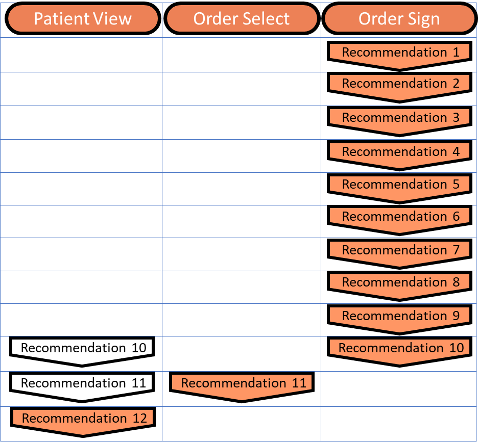

### Introduction

This implementation guide provides resources and discussion in support of applying the Centers
for Disease Control and Prevention (CDC) 2022 Opioid Prescribing Guideline:

[CDC 2022 guideline for prescribing opioids for subacute or chronic pain](https://www.cdc.gov/mmwr/volumes/65/rr/rr6501e1.htm)

This implementation guide was developed based on work initially done as part of the
<a href="https://confluence.hl7.org/display/CQIWC/Clinical+Quality+Framework">Clinical Quality Framework (CQF)</a>
Initiative, a public-private partnership sponsored by the Centers for Medicare &amp; Medicaid Services (CMS) and
the U.S. Office of the National Coordinator for Health Information Technology (ONC) to identify, develop, and harmonize
standards for clinical decision support and electronic clinical quality measurement, as well as a joint effort by
the Centers for Disease Control and Prevention (CDC) and the Office of the National Coordinator for Health IT (ONC)
focused on improving processes for the development of standardized, shareable, computable decision support artifacts
using the CDC 2022 Opioid Prescribing Guideline as a model case.

Feedback and contributions are welcome and can be submitted using the New Issue link in the footer of every page. Discussions on the
use of this IG as well as other CQF projects take place regularly on the <a href="https://confluence.hl7.org/display/CDS/CPGonFHIR">CPG-on-FHIR calls</a>, a subworkgroup of the HL7 Clinical Decision Support Workgroup.

### Scope

This implementation guide includes support for the following guideline recommendations:
* [Recommendation #1 - Nonpharmacologic and Nonopioid Pharmacologic Therapy Consideration](recommendation-01.html)
* [Recommendation #2 - Opioid Therapy Goals Discussion](recommendation-02.html)
* [Recommendation #3 - Opioid Therapy Risk/Benefit Discussion](recommendation-03.html)
* [Recommendation #4 - Opioid Immediate Release Form When Starting Opioid Therapy](recommendation-04-order-sign.html)
* [Recommendation #5 - Lowest Effective Dose](recommendation-05.html)
* [Recommendation #6 - Prescribe Lowest Effective Dose and Duration](recommendation-06.html)
* [Recommendation #7 - Opioid Therapy Risk Assessment](recommendation-07.html)
* [Recommendation #8 - Naloxone Consideration](recommendation-08.html)
* [Recommendation #9 - Consider Patient's History of Controlled Substance Prescriptions](recommendation-09.html)
* [Recommendation #10 - Urine Drug Testing](recommendation-10-order-sign.html)
* [Recommendation #11 - Concurrent Use of Opioids and Benzodiazepines](recommendation-11-order-select.html)
* [Recommendation #12 - Evidence-based Treatment for Patients with Opioid Use Disorder](recommendation-12.html)  

### Getting Started

For a quick start to get up and running and see how the artifacts work, refer to the [Quick Start](quick-start.html)

For clinical informaticists interested in how the behavior for the artifacts was determined,
refer to the [Process Documentation](process-documentation.html).

For an overview of how the artifacts are represented in the FHIR Clinical Reasoning resources,
refer to the [Integration Documentation](integration-documentation.html).

For a detailed description of how to implement the functionality with CDS Hooks calling into a
FHIR Clinical Reasoning server, refer to the [Implementation Documentation](implementation-documentation.html).

For a detailed description of how to implement the functionality with a Java-based CDS Hooks
service, refer to the [Service Documentation](service-documentation.html).

### Trigger Overview
 
 

